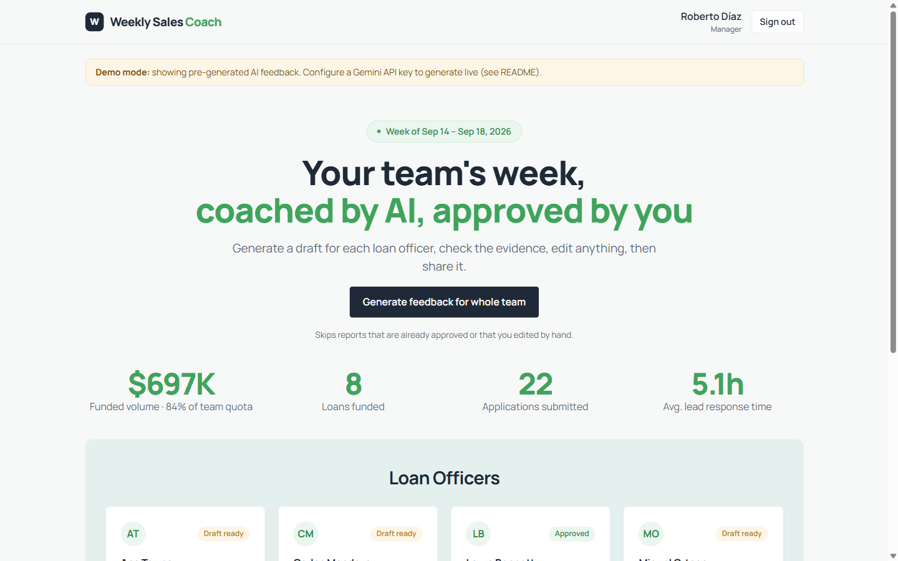
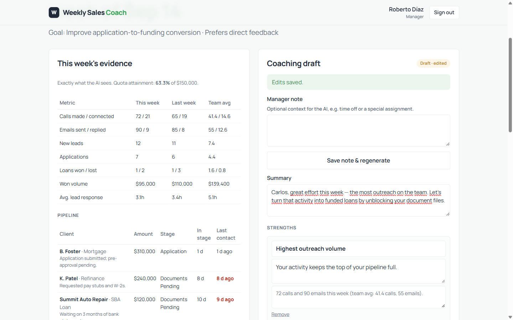
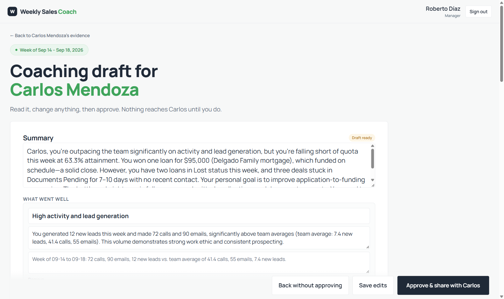
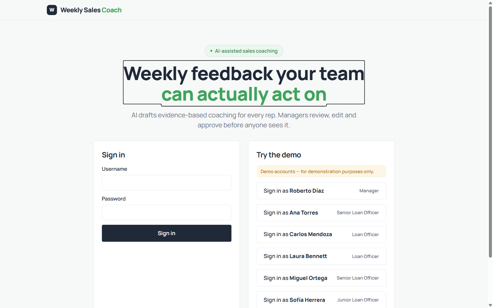
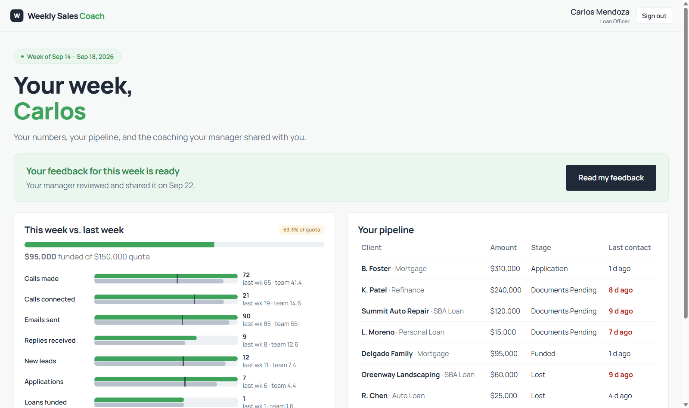

# Weekly Sales Coach

**AI drafts weekly, evidence-based coaching for every sales rep. The manager reviews, edits and approves it before the rep ever sees it.**

**Demo video (3 min):** [watch it here](https://youtu.be/Yxn-mL34G64)

Built as a take-home exercise for nuDesk. This document explains the business problem, what the tool does and why it was built this way, in plain language. Developers: see [README-DEV.md](README-DEV.md) for setup, architecture and the code map.



## The problem

Sales reps rarely get feedback they can act on. Coaching usually arrives late (at a quarterly review), vague ("keep it up", "push harder") and subjective. Managers know that short, specific, weekly coaching moves numbers, but writing it for eight or ten people every week takes hours they don't have. So it doesn't happen, and reps keep repeating the same avoidable mistakes: leads left waiting, files stuck in "documents pending", follow-ups that never go out.

The demo models a **loan-origination team** (loan officers selling mortgages, refinances, SBA and auto loans) because nuDesk works in financial services. The engine itself is generic: terms like "Loan Officer", "Funded" or "Lost" are configuration, not code.

## The solution in one paragraph

Each week the tool reads every rep's numbers (calls, emails, leads, applications, loans funded, response time), their trend against last week, the team average, every deal in their pipeline and an optional note from the manager. From that, the AI writes a short coaching draft: what went well, where to improve and one to three concrete actions for next week, **every point backed by a specific piece of evidence**. The manager checks the evidence, edits anything, and only then approves it. The rep signs in and sees the approved text, plus an email is prepared for delivery.

## How it works, step by step

1. **The manager opens the team dashboard.** Team KPIs at the top, one card per rep with quota attainment and the status of their coaching (not generated, draft, approved).
2. **"Generate feedback for whole team"** drafts coaching for every rep in about a minute, one rep at a time. Each rep gets a different message because each one has different data, a different trend, a personal goal and a preferred tone.
3. **The manager reviews one rep.** The left side shows exactly the evidence the AI saw. The right side shows the draft. A "manager note" (for example, "out two days for training") can be added and the draft regenerated so the AI takes it into account.
4. **The manager reads and edits the draft** on its own full-width screen with large type, then clicks **"Approve & share with <name>"**. Nothing reaches the rep before this click.
5. **The rep signs in** and sees a "your feedback is ready" notice, their own numbers versus last week and the team average, their pipeline, and the coaching in reading mode. Past weeks stay available.
6. **Changed your mind?** "Revise feedback" reopens an approved report as a draft. The rep stops seeing it, the manager fixes it, approves again, and the rep gets an "Updated" email.





## What makes the feedback useful

**It cites evidence.** Not "improve your follow-up" but "Summit Auto Repair has been in Documents Pending for 10 days with no contact in 9". The manager can verify every claim in seconds, and the rep can't dismiss it as an opinion.

**It is personal.** The demo team shows the range:

| Rep | Situation | What the coach picks up |
|---|---|---|
| Ana | Top performer, 125% of quota | Recognizes the wins; flags small leads waiting 8+ days |
| Carlos | Most activity on the team, low conversion | Four applications stuck in *Documents Pending* |
| Sofía | New hire, two months in, improving | Encouraging tone; celebrates her first funded loan |
| Miguel | Numbers dipped this week | Manager note says he was out two days for training, so he isn't penalized |
| Laura | Steady, but small loans | Her stated goal is to close larger loans; the draft focuses on the $400K referral |

**It is balanced.** Every draft has strengths and improvements. The tone adapts to tenure and to the rep's stated preference (direct or encouraging).

**It knows what it doesn't know.** When the data isn't enough to judge something, the AI says so in a "not enough data" section instead of guessing.

## The AI is a drafter, not a judge

This was the most important design decision, and it shapes everything:

- **Coaching, not scoring.** There are no rankings, grades or scores of people. The output is advice for next week.
- **Human in the loop.** The manager approves every word. The AI cannot publish anything.
- **Strict rules for the AI.** It must base every statement on the data and cite it. It must not invent numbers, comment on personal matters, recommend HR actions (firing, discipline, pay), name other reps, or guess.
- **Privacy by design.** The AI only sees the rep being coached plus an aggregate team average. No other rep's name or numbers. No sensitive personal attributes are collected at all.
- **Transparency.** The manager sees exactly what the AI saw, on the same screen as the draft.
- **Safe fallbacks.** If the AI service is down, slow or rate-limited, the manager gets a clear message and no existing draft is lost.

## What you get out of it

- **Time.** A manager reviews and approves ten drafts in the time it took to write two.
- **Consistency.** Every rep gets feedback every week, in the same structure, with the same fairness rules.
- **Better conversations.** The weekly 1:1 starts from specific facts and agreed actions, not from impressions.
- **A record.** Every approved report is stored per rep and per week, exportable to CSV, and every approval leaves an email in the outbox.

## Try it in two minutes

You need the free [.NET 10 SDK](https://dotnet.microsoft.com/download). Then:

```bash
cd src/WeeklySalesCoach
dotnet run
```

Open the URL printed in the console and use the **demo quick-login buttons** (demo accounts, for demonstration only; the password for all of them is `demo123`):

| Account | Role |
|---|---|
| `roberto` | Sales Manager |
| `ana`, `carlos`, `sofia`, `miguel`, `laura` | Loan Officers |

Laura's report starts already approved, so signing in as `laura` shows the finished result right away. Sign in as `roberto` to generate, review and approve the others.

Without an AI key the app runs in **demo mode**: it serves feedback that was pre-generated by the same AI integration, and a banner says so. With a Claude API key (see [README-DEV.md](README-DEV.md)) every draft is generated live; a report with the default model costs about one cent.





## What is deliberately out of scope

This is a working prototype, not a product. It uses a local file database and seeded demo data, sends no real email (the messages are composed and queued), and has no CRM connection. All of those have a clear place to plug in; see the "Next steps" section in the developer document.

## Built with

.NET 10 and Blazor for the application, SQLite for storage, and Claude (Anthropic) for the drafting, called through the official SDK with a fixed output schema so the model must return the expected structure. Gemini is supported as an alternative. All demo data is fictional.
